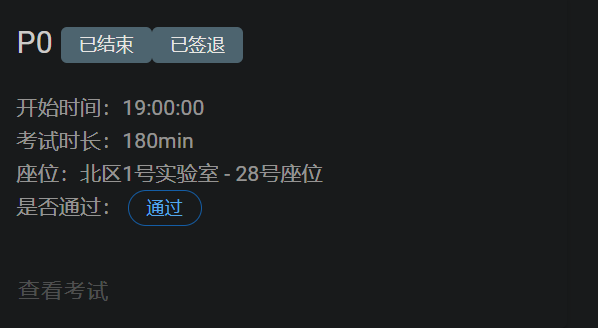

## P0 课下感想☹️

这次的P0课下一共有五道题，其中有一道题是附加题，不做也不会影响考试的！😁

其中最值得注意的就是`GRF`那道题，是真的很坑啊！

> 当我们在使用 **DMX 解复用器 + 寄存器**的组合的时候，一定要注意的就是**三态**的打开与关闭。
>
> 如果你想要除了选择编号的寄存器之外的寄存器保持原来的值而不是被重置为`0`的话，就一定要把三态打开！一定要把三态打开！一定要把三态打开！
>
> 当时我在这里纠结了三个多小时😭😭😭

*其他题目还好，就是一些状态机的搭建而已*

## P0 课上测试感想😇

今年的题是真的简单呀，一个小时就写出来啦，如果不是题目看错啦，甚至可以四十分钟做出来，嘻嘻😋*纪念一下*

简单了解了一下规则，一共是三道编程题，只需要做出两道就算过关，做出三道是优秀的必要条件，那看来是问答也要算分了！🫢

我没有回答上的一个小问题是：

> Logisim中灰色的线代表什么问题？
>
> 答案是：**线路的位宽未知**，发生这种情况是因为导线未连接到任何组件的输入和输出。

题目回忆不起来，就不回忆了 >_<
