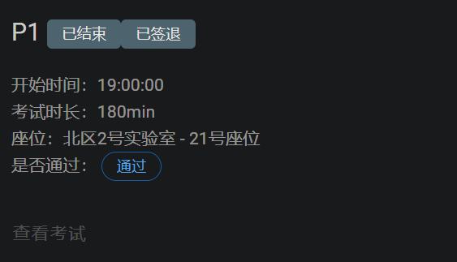

## P1 课下感想☹️

和P0不太一样，这次的P1是六道题，其中一道是附加题，因为国庆节的原因，P1的时间是两周，所以在后面开放了`统计图`模块，里面会有在线学习的参与情况，同时会有一些推荐练习题~（虽然我一道都没做，而且还是在考试当天下午才发现的😂）

### 状态机写法🫡

这里主要总结一下`verilog`写状态机的写法

```verilog
reg[1: 0] state, next_state;

parameter s0 = ......;
parameter s1 = ......;

//时钟沿上升，状态转移，同步复位
always@(posedge clk) begin
    if (reset) begin
        state <= 2'b0;
    end else begin
        state <= next_state;
    end
end

//时钟沿上升，状态转移，异步复位
always@(posedge clk, negedge reset) begin
    if (reset) begin
        state <= 2'b0;
    end else begin
        state <= next_state;
    end
end

//计算次态next_state
always@(*) begin
    ......

    case(state)
        s0: begin
            //状态转移
        end
        s1: begin
            //状态转移
        end
        ......
    endcase
end

//输出逻辑方案1
always@(*) begin
    out = ......
    //out需要是reg类型的
end

//输出逻辑方案2
assign out = ......
```

### 算术右移、逻辑右移🫡

算数右移需要在**左操作数**使用到`$signed()`，否则还是为逻辑右移

### 函数的使用🫡

```verilog
function [7:0] toLower(
    input [7:0] in;
)
    if(in >= "A" && in <= "Z") toLower = in + "a" - "A";
    else toLower = in;
endfunction

// 直接使用就是了
toLower(in)
```

### `testbench`漂亮写法🫡

> 来源：🥰
>
>  https://flyinglandlord.github.io/2021/10/24/BUAA-CO-2021/P1/P1%E8%AF%BE%E4%B8%8B%E5%AD%A6%E4%B9%A0/ 😜

```verilog
	always #1 clk = ~clk;
	initial begin
		// Initialize Inputs
		clk = 0;
		reset = 1;
		in = 0;
		data = "begin enDbegin xyzz eNd BeGin begin end endbegin end ";
		while(!data[0:7]) data = data << 8;
		#2;
		reset = 0;
         while(data[0: 7]) begin
			in[7:0] = data[0:7];
			data = data << 8;
			#2;
		end
		$finish;
	end
```

### 位拼接运算符🫡

注意**大括号**的位置

```verilog
assign ext = {imm, {16{1'b0}}};
```

## P1 课上测试感想😇

有一说一，我前几天还在说今年的P0比去年简单多了，结果P1给我拉了一坨大的！( 😞

前两道题还好，依然是十分迅速的就做出来了，接着我在八点二十左右开始写第三道题，到了九点钟，本来我是打算交卷走人了的，然后助教走过来给了我希望~😭

他让我接着再做一会，取消了我的交卷，这一会就是一个小时啊，我又做到十点钟，结果还是没做出来，一个测试点都没有通过，真的要笑死了，白白浪费一个小时的休息时间🤡🤡🤡🤡🤡🤡🤡🤡🤡🤡

而且中途还遇到了**ISE无法仿真的问题**，最后又重新新建了一个工程才解决

虽然做出来两道题，还是算通过，不过不能够优秀了啊，烦烦烦~😩😩😩😩😩😩😩😩😩😩😩😩😩😩😩😩


