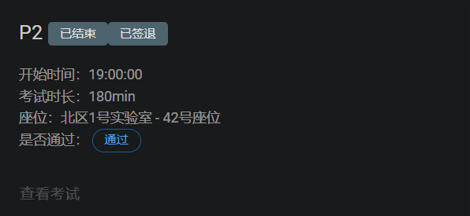

## P2 课下感想☹️

### 声明数组

```assembly
data: .word 0 : 256       # storage for 16x16 matrix of words
```

### 读取一个整数

```assembly
.macro get_int(%dst)
	li $v0, 5
	syscall
	move %dst, $v0
.end_macro
```

### 打印一个整数

```assembly
.macro print_int(%des)
	li $v0, 1
	move $a0, %des
	syscall
.end_macro
```

### 读取字符并存储

```assembly
.data
	string: .space 1024

.macro get_char(%dst)
	li $v0, 12
	syscall
	move %dst, $v0
.end_macro

Begin_1:
	slt $t0, $s1, $s0
	beqz $t0, End_1
	get_char($t1)
	sb $t1, string($s1)
	addi $s1, $s1, 1
	j Begin_1
End_1:
	li $s1, 0
	jr $ra
```

### 打印字符串

```assembly
.macro print_string(%des)
	li $v0, 4
	move $a0, %des
	syscall
.end_macro
```

### 打印空格和回车

```assembly
.data
	str_enter:  .asciiz "\n"
	str_space:  .asciiz " "
	
.macro printSpace
    la  $a0, str_space
    li  $v0, 4
    syscall                     # 输出一个空格
.end_macro

.macro printEnter
    la $a0, str_enter
    li $v0, 4
    syscall                     # 输出一个回车
.end_macro
```

### 获取一维整数数组地址

```assembly
.macro array_addr(%dst, %index)
	sll %dst, %index, 2
.end_macro
```

### 获取二维整数数组地址

```assembly
.macro matrix_addr(%dst, %row, %column, %rank)
    # dts: the register to save the calculated address
    # row: the row that element is in
    # column: the column that element is in
    # rank: the number of columns in the matrix
    multu %row, %rank
    mflo %dst
    addu %dst, %dst, %column
    sll %dst, %dst, 2
.end_macro
```

### 压栈入栈

```assembly
.macro push(%dst)
	addi $sp, $sp, -4
	sw %dst, 0($sp)
.end_macro
	
.macro pop(%dst)	
	lw %dst, 0($sp)
	addi $sp, $sp, 4
.end_macro
```

### 结束程序

```assembly
.macro end
	li $v0, 10
	syscall
.end_macro
```

### 易错点

在注意压栈入栈的时候，有些隐性的参数也是要进行保护的，比如循环变量 `i`

```c
// 全排列生成
#include <stdio.h>
#include <stdlib.h>

int symbol[7], array[7];
int n;

void FullArray(int index) {
    int i;
    if (index >= n) {
        for (i = 0; i < n; i++) {
            printf("%d ", array[i]);
        }
        printf("\n");
        return;
    }
    for (i = 0; i < n; i++) {
        if (symbol[i] == 0) {
            array[index] = i + 1;
            symbol[i] = 1;
            FullArray(index + 1);
            symbol[i] = 0;
        }
    }
}

int main() {
    int i;
    scanf("%d", &n);
    FullArray(0);
    return 0;
}
```

这种题在写函数的时候，除了要保护`index`以外，还需要保护`i`

```assembly
FullArray:
	push($ra)
	push($t0)
	push($t5)
	move $t0, $a0	# a0 = index
	move $t5, $s1	# s1 = i = 0
	
	# ……
	
	li $t5, 0
	pop($t5)
	pop($t0)
	pop($ra)
	jr $ra
```

## P2 课上测试感想😇

*下午上西方音乐史课的时候好紧张* 🤡

结束了，感觉还不错！在九点的时候三道题都做出来了，留个纪念~😚😚😚，弥补了我 P1 的伤痛



本次 P2 的后面两个题都是给出了C语言代码的，所以只需要照着进行翻译就可以了，不过需要注意的是第一题要稍微思考一下，不然会TLE，第二题要根据给出的C语言代码稍微改变一下，否则会不符合题意。😏

不过这次上机美中不足的是第三题没有一次性通过，de了一个小时左右的bug，累死了，bug原因就是**在调用函数时，传参把寄存器写错了**，完全是不小心啊啊啊啊😂😂😂

后面从P3开始就必须认真对待了，因为要卡人了~~~，希望之后的上机顺利！🥰🥰 HOPE！

> 这次考我的问题里面一个比较有价值的
>
> <u>延迟槽的作用是什么？</u>
>
> 正确答案应该是：**提高处理器的流水线效率**
