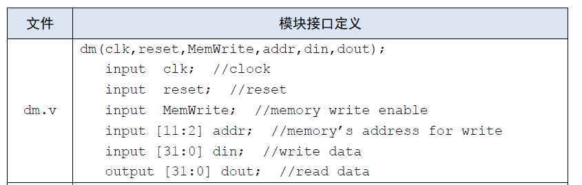

## P4 课下感想☹️

### 设计草稿

总体的思路是和P3一样的，只不过为了上课的测试，<u>对一些细节有优化</u>

对课下的指令增加了一条：j

#### NPC

端口定义

| 信号名      | 方向 | 描述                              |
| ----------- | ---- | --------------------------------- |
| PC[31:0]    | I    | 当前指令的地址                    |
| Imm16[15:0] | I    | beq：16位偏移（`sw`或`lw`指令）   |
| Imm26[25:0] | I    | jal：26位偏移（`j`或`jal`指令）   |
| RA32[31:0]  | I    | jr：`$ra`寄存器保存的32位目标地址 |
| NPCop[1:0]  | I    | NPC计算模式的控制码               |
| NPC[31:0]   | O    | 下一条指令的地址                  |
| PC4[31:0]   | O    | 当前指令加4的地址                 |

**NPCop 选择器**

| NPCop | 功能                                                       |
| ----- | ---------------------------------------------------------- |
| 00    | PC + 4                                                     |
| 01    | PC + 4 + sign_ext(Imm16 * 4) —— beq成功跳转                |
| 10    | PC + 4 + sign_ext(Imm26 * 4) —— J 型指令成功跳转（j、jal） |
| 11    | `$ra` 寄存器中存储的地址 —— jr 跳转                        |

NPC 里需要保证**偏移量都是 4 的倍数**，这样才可以直接忽略最低两位，取出相邻的指令

#### IM

端口定义

| 信号名            | 方向 | 描述       |
| ----------------- | ---- | ---------- |
| PC[31:0]          | I    | 指令的地址 |
| Instruction[31:0] | O    | 取出的指令 |

#### EXT

端口定义

| 信号名      | 方向 | 描述                   |
| ----------- | ---- | ---------------------- |
| Imm16[15:0] | I    | 16位数                 |
| EXTop       | I    | 0：零扩展；1：符号扩展 |
| Bit32[31:0] | O    | 扩展后的32位数         |

#### RF

端口定义

| 信号名    | 方向 | 描述                                                         |
| --------- | ---- | ------------------------------------------------------------ |
| A1[4:0]   | I    | 5位寄存器地址输入信号，将其储存的数据读出到 RD1（`rs`里面的值） |
| A2[4:0]   | I    | 5位寄存器地址输入信号，将其储存的数据读出到 RD2（`rt`里面的值） |
| A3[4:0]   | I    | 5位寄存器地址输入信号，将其作为写入数据的目标寄存器（`rd`寄存器） |
| WD[31:0]  | I    | 要写入的32位数据                                             |
| PC[31:0]  | I    | 当前指令的地址                                               |
| RFWr      | I    | 寄存器堆写使能信号：1：写使能信号有效；0：写使能信号无效     |
| Clk       | I    | 时钟信号                                                     |
| Reset     | I    | 异步复位信号：1：复位信号有效；0：复位信号无效               |
| RD1[31:0] | O    | 输出A1指定的寄存器中的32位数据                               |
| RD2[31:0] | O    | 输出A2指定的寄存器中的32位数据                               |

#### ALU

端口定义

| 信号名     | 方向 | 描述              |
| ---------- | ---- | ----------------- |
| A[31:0]    | I    | 32位输入A         |
| B[31:0]    | I    | 32位输入B         |
| C[31:0]    | O    | 32位输出C         |
| ALUop[3:0] | I    | 运算控制信号      |
| Zero       | O    | A = B：1；否则为0 |

**ALUop说明**

| 信号值 | 功能                   |
| ------ | ---------------------- |
| 3'b000 | A + B                  |
| 3'b001 | A - B                  |
| 3'b010 | A & B                  |
| 3'b011 | A \| B                 |
| 3'b100 | lui 指令               |
| 3‘b101 | Other 其他待添加的指令 |

#### DM

端口定义

| 信号名   | 方向 | 描述                                                 |
| -------- | ---- | ---------------------------------------------------- |
| A[31:0]  | I    | 内存中的地址信号                                     |
| WD[31:0] | I    | 在内存写使能信号有效时，写入内存地址的数据           |
| PC[31:0] | I    | 当前对应指令的地址                                   |
| DMWr     | I    | 内存写使能信号：1：写使能信号有效；0：写使能信号无效 |
| Clk      | I    | 时钟信号                                             |
| Reset    | I    | 异步复位信号：1：复位信号有效；0：复位信号无效       |
| RD[31:0] | O    | 输出内存中对应地址的数据                             |

需要注意的是，当只是实现 `lw` 和 `sw` 这两条指令的时候，需要保证**内存的地址是 4 的倍数**，所以简单一点就可以直接忽略地址中最低的两位。

但是如果是实现 `lb` `sb` `lh` `sh` 这些指令的时候是不需要保证内存是 4 的倍数

#### Control

除了 `Opcode` 和 `Funct` 作为输入以外，还增加了 `Zero` 输入，来判断是否需要成功跳转！

后续要增加指令的时候，**也可以使用这种输入的方式完成**

| 端口  | add  | sub  | ori  | lw   | sw   | beq         | lui  | nop  | j    | jal  | jr   |
| ----- | ---- | ---- | ---- | ---- | ---- | ----------- | ---- | ---- | ---- | ---- | ---- |
| NPCop | 00   | 00   | 00   | 00   | 00   | 01(Zero==1) | 00   | xx   | 10   | 10   | 11   |
| WRsel | 01   | 01   | 00   | 00   | x    | x           | 00   | x    | 00   | 10   | 00   |
| EXTop | x    | x    | 0    | 1    | 1    | 0           | 0    | x    | x    | x    | x    |
| WDsel | 00   | 00   | 00   | 01   | xx   | xx          | 00   | xx   | 00   | 10   | 00   |
| RFWr  | 1    | 1    | 1    | 1    | 0    | 0           | 1    | x    | 0    | 1    | 0    |
| Bsel  | 00   | 00   | 01   | 01   | 01   | 00          | 01   | x    | 00   | 00   | 00   |
| ALUop | 000  | 001  | 011  | 000  | 000  | 001         | 100  | xxxx | xxx  | xxx  | xxx  |
| DMWr  | 0    | 0    | 0    | 0    | 1    | 0           | 0    | x    | 0    | 0    | 0    |

### 设计图

[]: CPU.drawio.html

### 思考题

1. 阅读下面给出的 DM 的输入示例中（示例 DM 容量为 4KB，即 32bit × 1024字），根据你的理解回答，这个 addr 信号又是从哪里来的？地址信号 addr 位数为什么是 [11:2] 而不是 [9:0] ？

	> addr 信号应该是从 ALU 模块中的输出来的，是要写入的地址
	>
	> 忽略最低两位，保证字对齐，都是 4 的倍数

2. 思考上述两种控制器设计的译码方式，给出代码示例，并尝试对比各方式的优劣。

	> 我觉得应该是**指令对应的控制信号如何取值**更加直观，因为对于增添指令来说很方便！

3. 在相应的部件中，复位信号的设计都是同步复位，这与 P3 中的设计要求不同。请对比同步复位与异步复位这两种方式的 reset 信号与 clk 信号优先级的关系。

	> 在同步复位中：clk 的优先级更高，需要在 clk 是上升沿的时候才能进行复位
	> 
	> 在异步复位中：reset 的优先级更高，当 reset 上升到 1 的时候就要立马进行复位

4. C 语言是一种弱类型程序设计语言。C 语言中不对计算结果溢出进行处理，这意味着 C 语言要求程序员必须很清楚计算结果是否会导致溢出。因此，如果仅仅支持 C 语言，MIPS 指令的所有计算指令均可以忽略溢出。 请说明为什么在忽略溢出的前提下，addi 与 addiu 是等价的，add 与 addu 是等价的。提示：阅读《MIPS32® Architecture For Programmers Volume II: The MIPS32® Instruction Set》中相关指令的 Operation 部分。

	> 略，自行查看手册

## P4 课上测试感想😇

P4 的课下已经结束了，这一次真的是过的非常的凶险，差一点点就挂掉了！🤓

第一题就很坑，我先是写了一个小时，一直过不去，就转做二三题了，幸好，这两道题我连`testbench`都没写就轻松过关了，这个时候我的心态就很放松了，不像最开始第一题写不出来那样慌得一批。

后面又去做第一道题，还是没做出来~~我真是服了😂😂😂

<u>纪念一下P4</u>

> 第一题的大概关键点
>
> 主要就是取`RF[rs]`的低16位去模17，然后根据`RF[rt]`的最高一位是否是0，判断对这个模的值进行1或0扩展，再赋值给`RF[rd]`
>
> **题目中说明了`RF[rs]`的低16位看作是补码形式的有符号数，最后模的值应该是最小的非负整数**，我就是一直在这部分出错了
>
> - 最开始我是直接加上`$signed()`，但是一直不对，原因应该是如果考虑数16'hffff，它代表十进制的无符号65535，以补码形式代表有符号的-1，对于Verilog的`%`符号来讲，模出来的值应该是-1，但是我们应该要得到最小的非负整数16，所以要加上17才是正确答案。
> - 分成两种情况，<u>一种是大于0，直接取模得答案；另一种是小于0，取模后要加上17</u>

**以后要多注意这种细节上的问题，对于不确定的一定要在草稿纸上多演算**😭😭😭😭😭😭😭

——祝P5顺利！