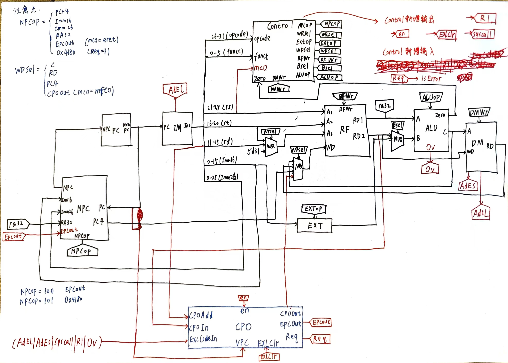
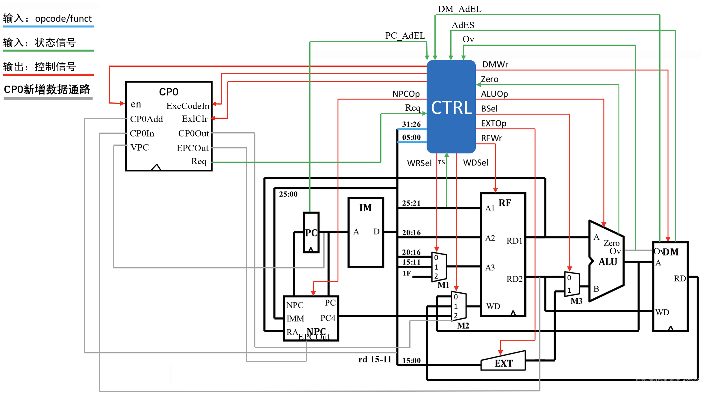

## P5 课下感想☹️

### 设计草稿

这次高工的P5是和计算机学院的不同的，主要是关于单周期CPU的异常与处理，核心部件是CP0的设计

这里放出设计图

### 扩展

从图纸中，我们可以看到我这里是将所有异常送入CP0进行处理的，根据**“高内聚低耦合”**的思想，也可以借鉴高小鹏老师的设计，**<u>放入Control中进行统一处理，再送入CP0</u>** 🥰🥰🥰

这里放出讨论区中姜同学的设计图，我觉得比我的要好很多！<u>我最后一版也照此进行了修改</u> 🫡🫡🫡

## P4 课上测试感想😇