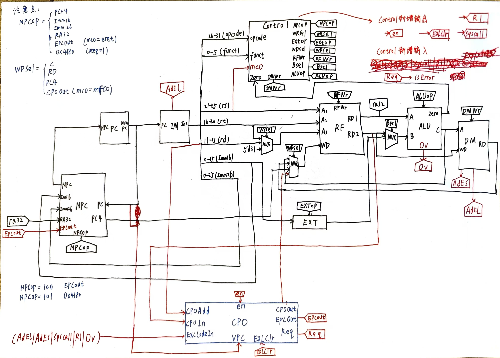
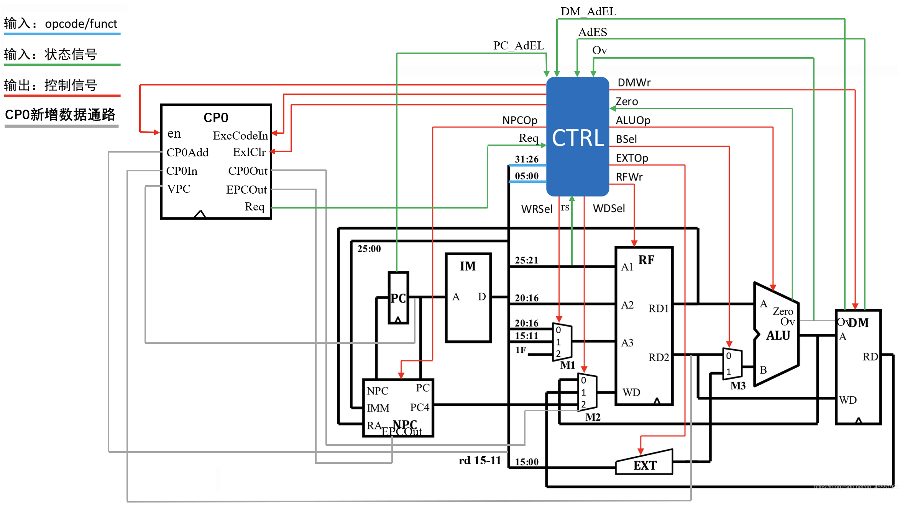

## P5X 课下感想☹️

### 设计草稿

这次高工的P5X是和计算机学院的不同的，主要是关于单周期CPU的异常与处理，核心部件是CP0的设计

这里放出设计图



### 扩展

从图纸中，我们可以看到我这里是将所有异常送入CP0进行处理的，根据**“高内聚低耦合”**的思想，也可以借鉴高小鹏老师的设计，**<u>放入Control中进行统一处理，再送入CP0</u>** 🥰🥰🥰

这里放出讨论区中姜同学的设计图，我觉得比我的要好很多！<u>**我最后一版也照此进行了修改**</u> 🫡🫡🫡



## P5X 课上测试感想😇

第一次P5X是挂掉了的，这也是我第一次GAP，呜呜呜呜呜，不过也好，这一周明显可以感到轻松了许多🥳🥳🥳🥳🥳

适当的休息也是一件好事对吧🥰🥰🥰

纪念第一个gap，希望后续不会再有了吧 😭


### 第一次课上测试感想 🤣🤣🤣

因为我们高工是第一次做这种P5X，没有前辈的经验，导致大家不清楚课下究竟会出现什么样的错误（毕竟<u>课下的强测点实在是太弱了</u>）

课上的测试点前两个是关于增加指令的，第三个就是课下的强测点，我们高工去了**六个人考P5X，结果就过了一个，挂五个**，也是没谁了，大家都是死在了强测上 😱😱😱

真挺搞笑的，课上改课下的错误，但是大家一个都改不出来，主要是考试的时候还是坐一起考的，真的是面面相觑~~~

#### fix bug

经过几天的Bug查找与修复，发现的问题主要有这几个，前两个甚至是P4的问题，我都不知道我P4课上是怎么通过的 😝

##### IM 寄存器空间太小

```verilog
`define codeNum  4096 	//4048
```

最开始我的`codeNum`分配的大小是4048，但是在P4的指导书中可以明确的看到是4096，我都不知道为什么当时我写了这么一个神奇的数字

如果空间分配过小可能会导致当PC过大的时候，出现了数组越界的情况，进而导致取出来的`Instruction`时`xxx`，然后后面的Control模块里面出来的`NPCop`是`xxx`，就会让NPC重新跳转到最开始的32'h0000_3000去了

```verilog
    always @(*) begin
        if (NPCop == 3'b000) begin
            NPC = PC + 4;
        end
        else if(NPCop == 3'b001) begin
            // beq 成功跳转
            NPC = PC + 4 + {{14{Imm16[15]}}, Imm16, 2'b00};
        end
        else if(NPCop == 3'b010) begin
            // J 型指令跳转（j/jal）
            NPC = {PC[31:28], Imm26, 2'b00};
        end
        else if(NPCop == 3'b011) begin
            // jr 指令读取 $ra 寄存器，成功跳转
            NPC = RA32;
        end
        else if(NPCop == 3'b100) begin
            NPC = EPCout;
        end
        else if(NPCop == 3'b101) begin
            NPC = 32'h0000_4180;
        end
        else begin
            NPC = 32'h0000_3000;
        end
    end
```

##### IM 指令取指位数太小

```verilog
Instruction = Registers[tmpPC[13:2]];
// Instruction = Registers[tmpPC[11:2]];
```

最开始我使用的是`tmpPC[11:2]`，但这样的PC最多是3000左右，如果PC过大的时候会出现Bug，所以要改为`[13:2]`

##### CP0 同步异步操作

```verilog
    always @(posedge Clk) begin
        if (Reset) begin
            SR <= 32'h0;
            Cause <= 32'h0;
            EPC <= 32'h0;
        end else begin
            // 写入操作
            if (En) begin
                case (CP0Add)
                    5'd12: SR <= CP0In;        // 写入 SR 寄存器
                    5'd13: Cause <= CP0In;     // 写入 Cause 寄存器
                    5'd14: EPC <= CP0In;       // 写入 EPC 寄存器
                    default: ;
                endcase
            end
            
            // EXLClr 信号清除 SR[1] 位
            if (EXLClr) begin
                SR[1] <= 1'b0;
            end

            if ((ExcCodeIn != 5'b00000) && (SR[1] == 0)) begin
                Cause[6:2] <= ExcCodeIn;      // 记录异常类型
                EPC <= VPC;                   // 若 EXL 位为 0，保存受害 PC
                SR[1] <= 1'b1;                // 设置 EXL 位          
            end
        end
    end

    // 读操作
    always @(*) begin
        case (CP0Add)
            5'd12: CP0Out = SR;
            5'd13: CP0Out = Cause;
            5'd14: CP0Out = EPC;
            default: CP0Out = 32'h0;
        endcase
    end

    // EPC 输出
    assign EPCOut = EPC;

    assign Req = (ExcCodeIn != 5'b00000) && (SR[1] == 0);
```

根据我的经验，一个模块中，**要向寄存器写值的时候一定是同步操作，也就是和时钟有关，而寄存器的读取和线路的输出都是异步操作，实时更新的，与时钟无关**。

如果不按照这个思想去实现的话，你可能会在某一个测试点挂掉！

##### DM `sw`异常判断的同步异步操作

```verilog
    // 写入操作：时序逻辑
    always @(posedge Clk) begin
        AdEs <= 1'b0;
        if (Reset) begin
            for (i = 0;i < 3072;i = i + 1) begin
                Datas[i] <= 32'h0;
            end
        end
        else begin
            if (DMWr) begin
                Datas[A[13:2]] = WD;
                $display("@%h: *%h <= %h", PC, A, WD);
            end
        end
    end

    // 读出操作：组合逻辑
    always @(*) begin
        AdEl = 1'b0;
        AdEs = 1'b0;
        if (DMJudge) begin
            if (A[1:0] != 2'b00 || A > 32'h0000_2fff || A < 32'h0000_0000) begin
                AdEs = 1'b1;
            end
        end
        if (!DMJudge && WDsel == 3'b001) begin
            if (A[1:0] != 2'b00 || A > 32'h0000_2fff || A < 32'h0000_0000) begin
                AdEl = 1'b1;
            end else begin
                RD = Datas[A[13:2]];
            end
        end
    end
```

这是我的DM中的模块具体实现，可以看到虽然执行`sw`指令的时候，是同步的操作，但是判断`sw`异常的时候一定要是异步的操作才对，不能放在同步的逻辑中

这就导致了Control信号出来的有两个关于DM写入的信号：`DMWr`和`DMJudge`，其中，`DMJudge`只与`sw`指令有关，而`DMWr`与`sw`和异常均有关，当`sw`异常出现的时候，`DMWr`关闭但是`DMJudge`不关闭。

### 第二次课上测试感想 🤣🤣🤣

这次的课上很简单，还是一道强测加上两道新加指令的题目，一般强测过了那两道题就会很简单，我一个半小时就AK啦😚

**中间还出现了一个小Bug，异常判断的那个寄存器一开始要初始化为0！**


下一关：P6X流水线，加油！！！🫡🫡