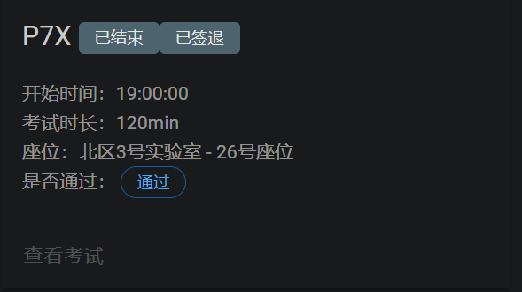

## P7X 课下感想☹️

P7X的课下一共是两个部分，都是要求使用C语言完成，所以可以摆脱`verilog`的苦海啦🥳🥳🥳

### cache模拟实验部分

教程详见PDF文档 [cache 模拟实验](cache模拟实验-计算机组成教程.pdf)

可以直接看代码参考，注意代码的架构要适合课上的修改，一般来说多采用结构体的封装就对了。

### 矩阵转置部分

详细的解释见PDF笔记文档 [矩阵转置](矩阵转置-计算机组成教程.pdf)

Tips：这个部分课下并不是强制要求通过，所以课上也不会对此进行考察

## P7X 课上测试感想😇

纪念一次性通过P7X，也是最后一次考试压哨通过，致敬P6挂了这么多次的我……

P7X课上有三道题，一道题是课下强测，另外两道要求全部通过才能算考试通过，要求还是比较严苛的😨😨😨

感觉课上没什么好说的，就是课下的代码只要有很好的封装性（我觉得可以参考我的代码，自我感觉封装的很好哈哈哈哈哈哈哈🥰），课上就很容易修改，通过也是简简单单的事。

一点小Tip：写Cache实验部分的时候，可以不用在命令行中编译成了可执行文件之后再进行参数输入运行的操作，可以直接修改C代码中的输入函数，改为直接从文件中读入，这样调试的时候也方便直接打断点进行调试输出。🥳🥳🥳🥳

至此，计组通关！😚😚😚
