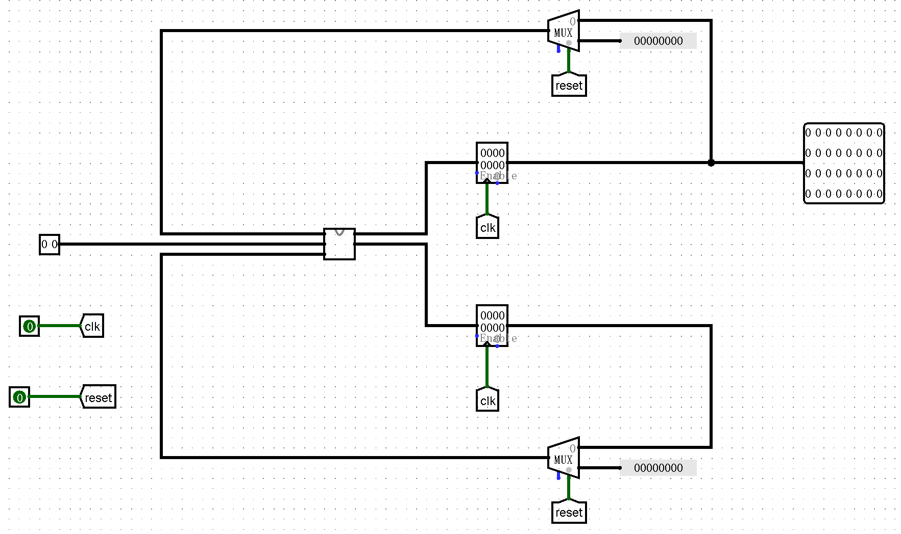

## Pre 课上测试感想😇

今年的Pre课上测试考试时长两个小时，只有编程题三道，分别对应的是预习部分的`Logisim`、`Verilog`和`MIPS`汇编。由于`verilog`和`MIPS`汇编都是比较简单的两道题，并且我是从后面往前面做的，所以考试的前期十分顺利，只用了一个小时就把两道题做完了，最后剩一道`Logisim`，我心想一个小时一道`Logisim`，这不是稳了？

**结果悲剧发生了**😭😭😭

题目要求是搭建一个序列生成器，`Moore`机结构，同步复位。但当时我对于`logisim`搭建时序电路并不熟悉，跟更别说`FSM`和同步、异步复位的操作了（🤡，结果就是我交上去的文件一直检测有两个测试点不通过，于是我便开始疯狂的增删寄存器，然后就是越错越离谱☹️。（更别说这还有该死的3分钟提交冷却时间，更搞心态了😁）

最后到了九点钟，考试结束是答疑时间，我一看到那个提示电路就知道哪里错了，把同步复位搞成了异步复位，把`Moore`机搞成了`Mealy`机，于是马上修改完再次提交，这次是终于过了！🥰

不过我还是想吐槽一下学校的机房，*太烂了*，虽然我还是在比较好的新北考的，键盘实在是用不顺手！

**Tip：**可能是因为确实九点钟做完的就只有几个人，最后的时间改成了三个小时，让我也通过啦！🥰*纪念一下第一过关*


### Logisim 部分

要求是搭建一个序列生成器，能够实现**同步复位**，状态机类型为**Moore机**。

输入`Type`为两位，一共有三种输入：

- `Type`为0时，输出 $a_n = 0$ 
- `Type`为1时，输出 $a_n = a_{n-1} + 1$ ，当初始状态时输入为1时，$a_n = 0 + 1$
- `Type`为2时，输出 $a_n = \sum_{0}^{n-1}{a_i}$

当加法溢出时，保留下32位，所有的输出值均为32位

| 信号名       | 方向 | 描述         |
| ------------ | ---- | ------------ |
| type[1:0]    | I    | 输入命令     |
| reset        | I    | 同步复位信号 |
| clk          | I    | 时钟信号     |
| output[31:0] | O    | 输出的值     |

Tip：需要两个寄存器，一个用于保存 $a_{n-1}$ ，另一个则用于保存前面的所有值



**注意这里面的同步异步复位的区别，注意Moore机和Mealy机的区别**😇😇😇😇😇

### Verilog 部分

一道十分简单的组合逻辑，要求是实现两个32位向量的点乘，并且还规定了向量的每一维都是0或者是1，所以就相当于是将向量的每一位分别对应相乘，最后相加即可。
需要用的知识其实就是`verilog`中`for`循环的使用！

```verilog
integer      i ;
for (i = 0; i <= 31; i = i + 1) begin
        ************
end
```


### MIPS 汇编部分

比较简单，甚至给出了C语言代码，照着进行翻译就可以了，唯一一点就是注意代码的缩进。
