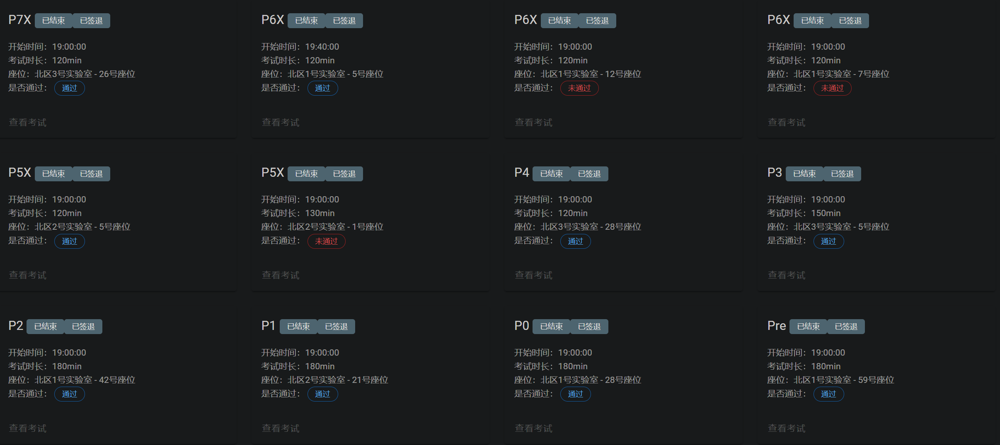

# BUAA_CO
My Computer Organization lab and reflection

2024年BUAA北京航空航天大学秋季学期计算机组成原理个人实验仓库，主要P5之后的实验针对于计算机拔尖计划，与计算机大类有所不同。

- **Pre**：`Logisim` + `verilog` + MIPS汇编，主要考察教程的预习情况
- **P0**：课下：搭建CRC校验码计算电路， ALU, GRF，正则表达式匹配；课上：Logisim完成部件及FSM设计
- **P1**：课下：实现splitter, ALU,EXT，格雷码计数器，合法表达式识别；课上：Verilog-HDL完成部件及FSM设计
- **P2**：课下：MIPS汇编语言完成矩阵乘法、回文串判断、卷积运算；课上：程设编程题，使用MIPS汇编语言完成
- **P3**：完成支持8条指令的单周期CPU设计
- **P4**：完成支持10条指令的单周期CPU设计
- **P5X**：完成支持异常处理的单周期CPU设计
- **P6X**：Verilog开发流水线CPU，完成支持10指令流水线CPU设计
- **P7X**：Cache实验

纪念一下全部通关！🥰

